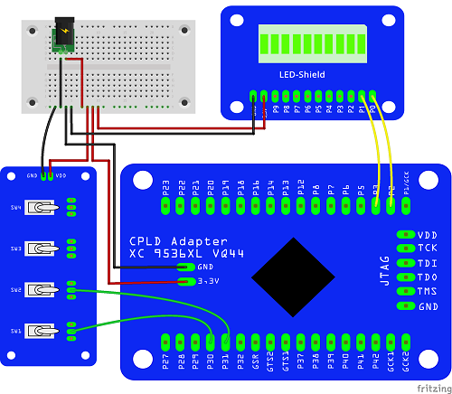

# CPLD-Adapter

CPLD-Adapter board for using a Xilinx XC9536XL

Get it at Aisler: https://aisler.net/p/JLAMCPYS

 

# Example

For this example we use the CPLD-Adapter board, the LED-Shield and the Switch-Shield.
For programming, we use the ISE 14.7 WebPack Software and an USB-JTAG Programmer.
You can buy it at https://eckstein-shop.de/Platform-Cable-USB or other distributors like Amazon etc.

# First step: getting and installing the software

There is a lower version of the software. You can find it on the DVD of the Platform-Cable set.

For the last ISE 14.7 WebPack and for licensing create a Account at Xilinx and dowload the last standart version, not the Win10 Version.
You have to customize some files later for working on Win10, because it´s not a supported Version for Win10. 
We do this later.

After installing you have to get a licence for the WebPack Edition.

# Second step: get it run

If you are using Win10, you have to customize some files to run the software likely stable.
Use this following steps: https://www.xilinx.com/support/answers/62380.html

# third step: Your first Project

| Part  | Port |
|------ |------|
| SW 1  | P30  |
| SW 2  | P31  |
| LED 1 | P2   |
| LED 2 | P3   |

The IO-Ports of the Xilinx 9536XL are 5V tolerable so you can use 5V signals for input. 
The output voltage depends on the supply voltage and is about 3,3V. 

